# AU Council Explorer 🗺️

An open-source web app that aggregates local council data across **all of Australia** — Melbourne, Sydney, and every state — into a single searchable, interactive platform.

**Live demo:** [https://au-council-explore.vercel.app](https://au-council-explore.vercel.app) · **GitHub:** [sarahwangy/AU-council-explore](https://github.com/sarahwangy/AU-council-explore)


---

## Why I Built This

Moving to a new city, I wanted to know: which council area should I live in? Which suburbs have good childcare, libraries, parks? What's the median house price? What languages do people speak there?

Every council has its own website in a different format, and the ABS data is buried in spreadsheets. I wanted one platform to explore any Australian council — browse community events, compare demographics, and understand what life is actually like in each area.

---

## What You Can Explore

### Community Events & Services
- **Library events** — upcoming events from councils across Australia (storytime, workshops, exhibitions)
- **Childcare & playgroups** — local services for families
- **Hard rubbish collection** — scheduled dates by council
- **Hospitals & health facilities** — nearby health services by area

### Council Demographics (ABS 2021 Census)
- **Population** — total residents, growth rate, population density
- **Area size** — land area in km²
- **Education levels** — percentage with university degrees, vocational qualifications
- **Languages spoken** — top languages in the area (English, Mandarin, Vietnamese, etc.)
- **Median house price** — property market data by council

### Map & Compare
- **Interactive Australia-wide map** — all councils coloured by state/region (Mapbox GL JS)
- **Council pages** — deep-dive into any council: stats, events, facilities
- **Compare view** — side-by-side comparison of 2–3 councils across any dimension
- **Search & filter** — find councils by name, state, population size, or demographic feature

---

## Pages

### 🗺️ Interactive Map

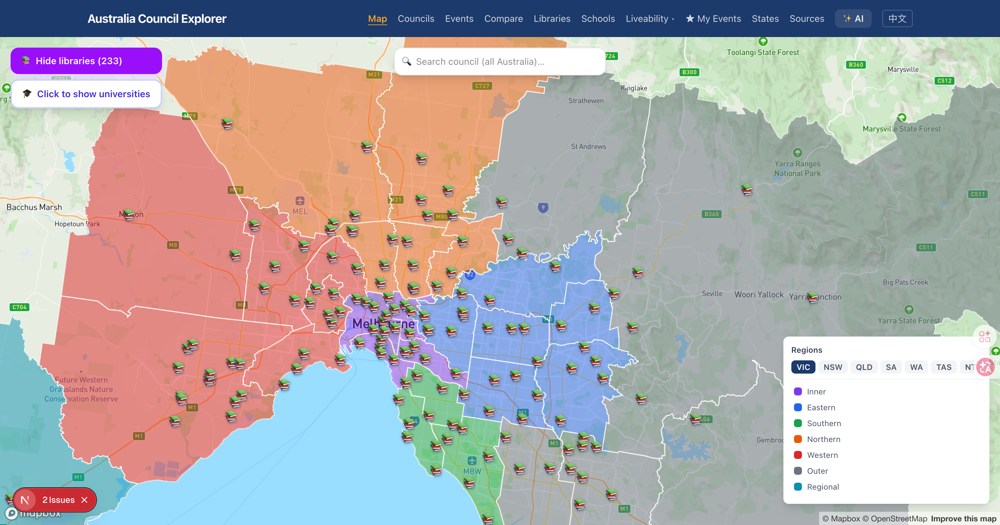

Australia-wide Mapbox map with all councils coloured by state. Click any council to fly to its boundary and open the detail page. Switch between states using the tab bar. Search any council name across all of Australia.

---

### 🏛️ Councils List

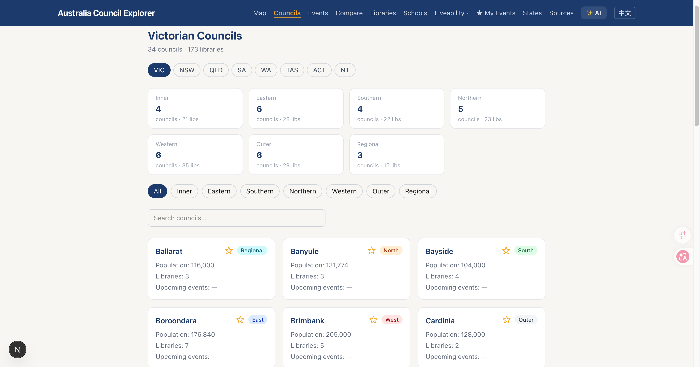

Browse all councils grouped by state. Filter by region, search by name. Each card shows population, area size, and Liveability Score at a glance.

---

### 📋 Council Detail

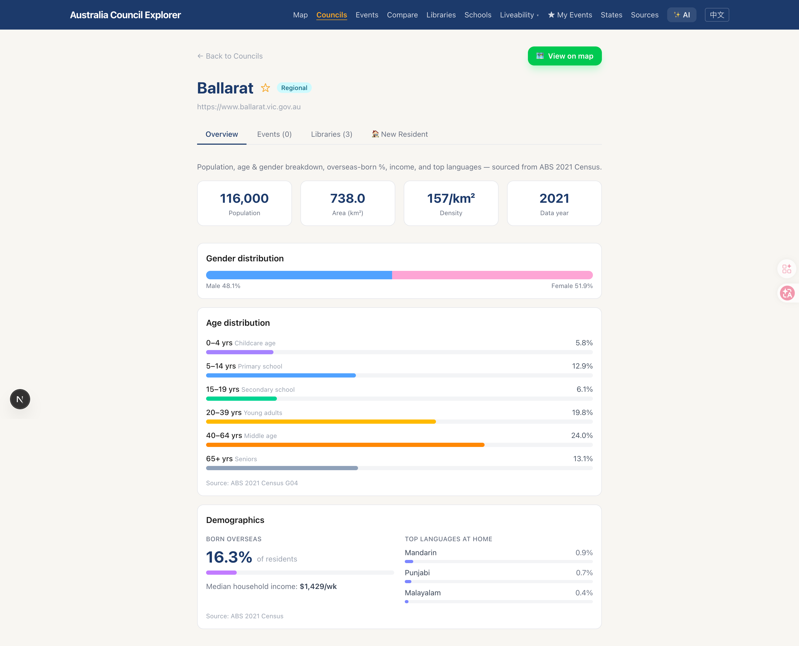

Deep-dive into any council: population, languages spoken, education levels, median house price, library events, and nearby facilities. Liveability Score breaks down across childcare, hospitals, libraries, and playgrounds.

---

### 📅 Events Calendar

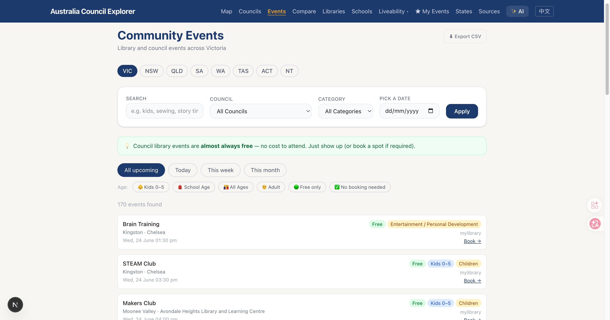

Upcoming events aggregated from 50+ library systems across all states — storytime, workshops, exhibitions, community programs. Filter by state, council, or date.

---

### ⚖️ Compare

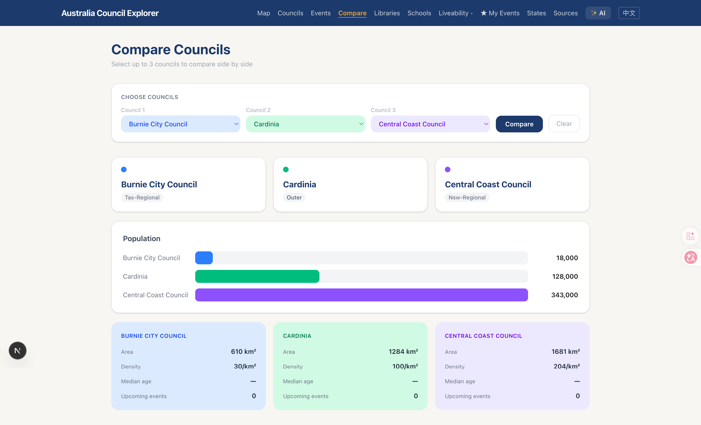

Select 2–3 councils and compare them side-by-side across population, Liveability Score, childcare density, hospital coverage, and library count.

---

### 📚 Libraries

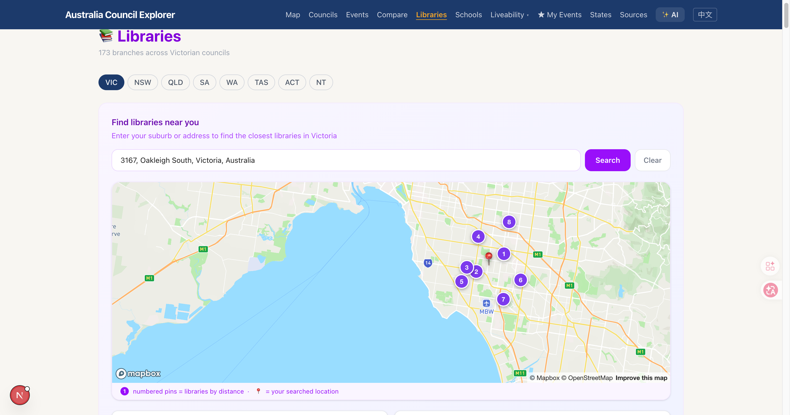

Browse libraries by state, see opening hours and today's open/closed status, and search nearby libraries from any address.

---

### 🏫 Schools & School Zones

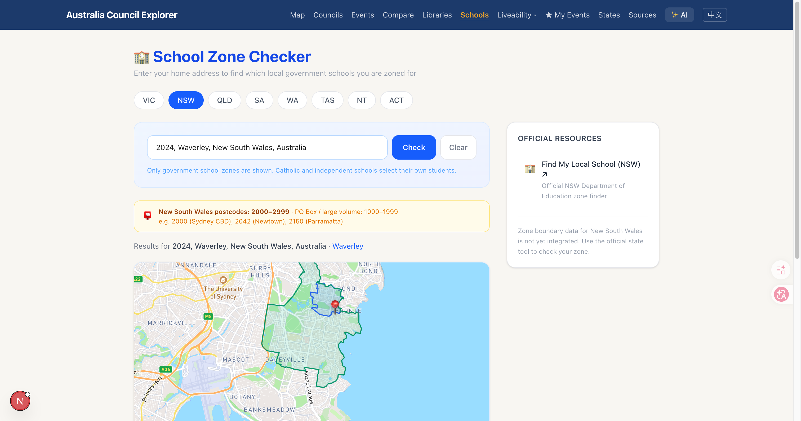

Enter any address to check which school zone you're in. VIC, NSW, and QLD zone data with polygon map overlay.

---

### 👶 Childcare Finder

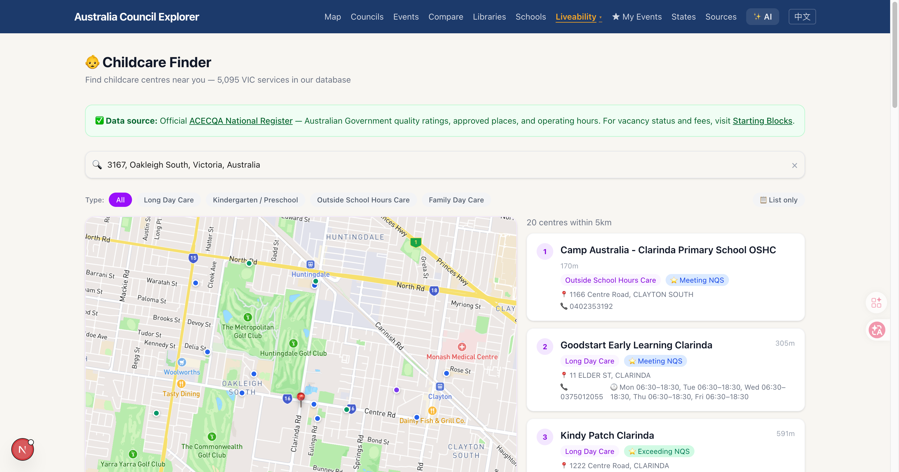

Search childcare centres from the ACECQA national register. Filter by suburb, see quality ratings, operating hours, and map view. VIC data covers 6,303 official services.

---

### 🏥 Hospital Finder

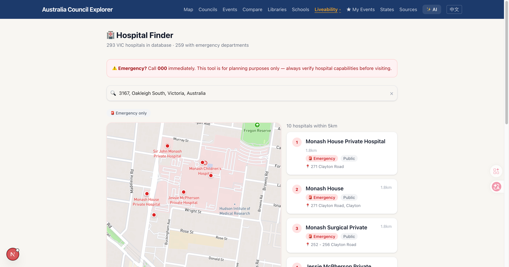

Find hospitals and health facilities near any location. Filter by emergency department availability. Click any hospital to fly to it on the map.

---

### 🛝 Playground Finder

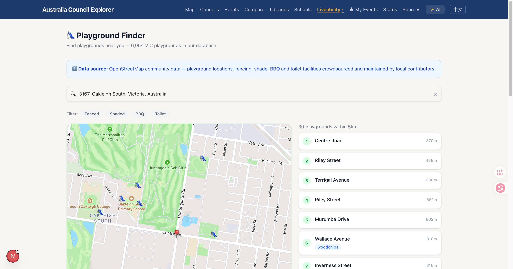

Browse playgrounds with amenity filters: fenced, shaded, BBQ, toilets nearby. 6,054 VIC playgrounds with 97.9% named via Nominatim reverse geocoding.

---

### ★ My Events

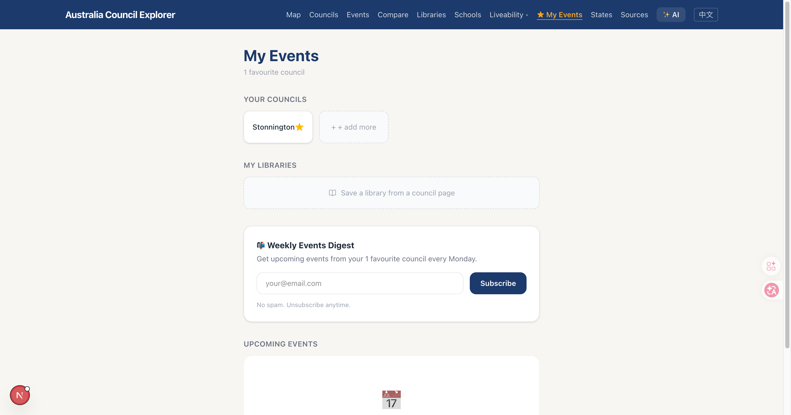

Star your favourite councils and libraries to build a personalised event feed. Shows only upcoming events from your saved locations, grouped by date.

---

### ✨ AI Search

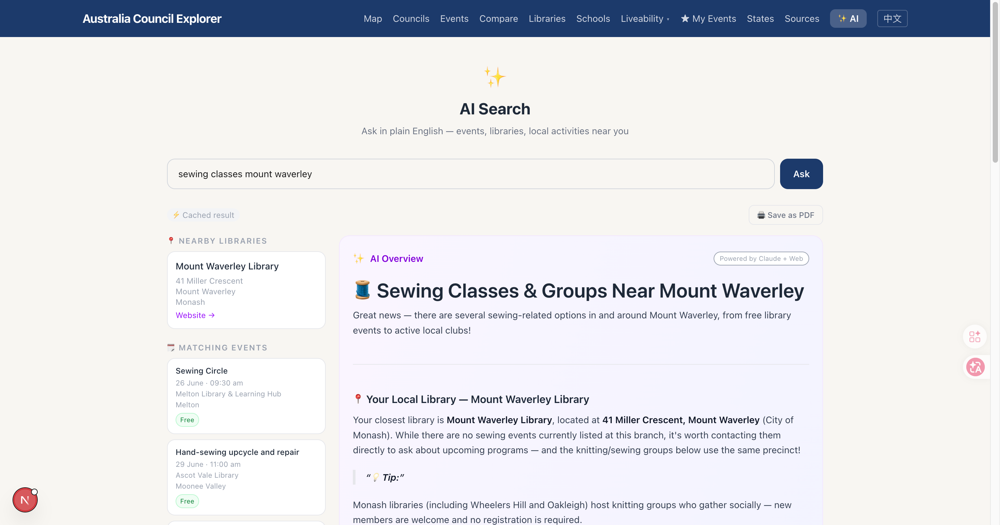

Ask anything in natural language: "Which council near Melbourne has the best childcare density?" Claude Haiku reads your question and returns a structured comparison with citations to real data.

---

### 🔗 Data Sources

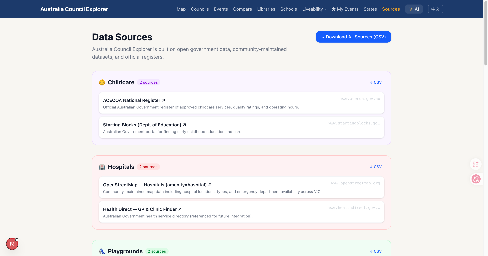

Every data source used in the platform, organised by state — 50+ library links, government datasets, and API references. CSV download available.

---

## Architecture

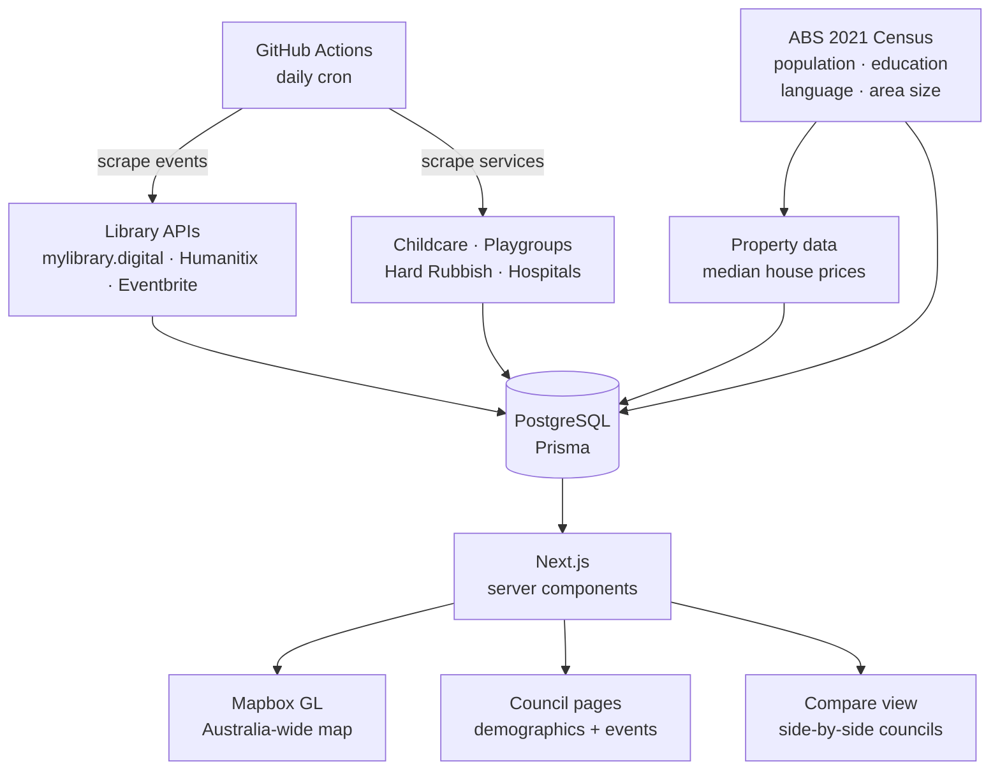

---

## Data Sources

| Data | Source | Update frequency |
|---|---|---|
| Council boundaries | ABS ASGS Ed 3 2021 | One-time |
| Population, area, education, language | ABS 2021 Census (G01, G09, G14) | 5-yearly |
| Median house prices | Property market data | Periodic |
| Library events (mylibrary.digital) | Kingston, Melton, Moonee Valley, Maroondah | Daily |
| Library events (Humanitix) | Wyndham | Daily |
| Library events (Eventbrite) | Merri-bek | Daily |
| Childcare & playgroups | State government directories | Weekly |
| Hard rubbish collection | Council websites | As published |
| Hospitals & health facilities | Health department data | Periodic |

---

## Coverage

- **Victoria** — all 79 LGAs including Melbourne metro and regional councils
- **New South Wales** — Sydney metro and regional councils
- **All states** — expanding to full national coverage

---

## Tech Stack

| Layer | Technology |
|---|---|
| **Framework** | Next.js 14 App Router + TypeScript |
| **Database** | PostgreSQL ([Neon](https://neon.tech)) + Prisma ORM |
| **Map** | Mapbox GL JS |
| **Styling** | Tailwind CSS v4 |
| **Scrapers** | Node.js + Cheerio, Eventbrite API, Humanitix API |
| **Automation** | GitHub Actions daily cron |
| **Deployment** | Vercel |

---

## Local Setup

### Prerequisites
- Node.js 20+
- PostgreSQL database (free tier: [Neon](https://neon.tech))
- Mapbox account (free tier)

### Steps

```bash
git clone https://github.com/sarahwangy/AU-council-explore
cd AU-council-explore
npm install

# Copy env template and fill in your values
cp .env.local.example .env.local
# DATABASE_URL=postgresql://...
# NEXT_PUBLIC_MAPBOX_TOKEN=pk.xxx
# EVENTBRITE_TOKEN=xxx (optional)

# Run DB migrations
npx prisma migrate dev

# Seed councils
npx tsx scripts/seed-councils.ts

# Import ABS population data
npx tsx scripts/import-abs.ts

# Run scrapers to populate events
npx tsx scripts/run-scraper.ts

# Start dev server
npm run dev
```

### GeoJSON boundaries

Download LGA boundaries for the homepage map:
1. Go to [ABS Digital Boundary Files](https://www.abs.gov.au/statistics/standards/australian-statistical-geography-standard-asgs-edition-3/jul2021-jun2026/access-and-downloads/digital-boundary-files)
2. Download "Local Government Areas ASGS Ed 3 2021 GDA2020" → GeoJSON
3. Save as `public/australia-lgas.geojson`

---

## Roadmap

- [ ] Custom scrapers for remaining Melbourne councils (Boroondara, Frankston, Darebin, Yarra)
- [ ] Full NSW and QLD council coverage
- [ ] AI Chat (RAG) — natural language queries: "which council near Sydney has the most childcare?"
- [ ] Email subscriptions for weekly local event digests
- [ ] Multi-language support (Chinese, Vietnamese)
- [ ] Mobile-optimised council card view
